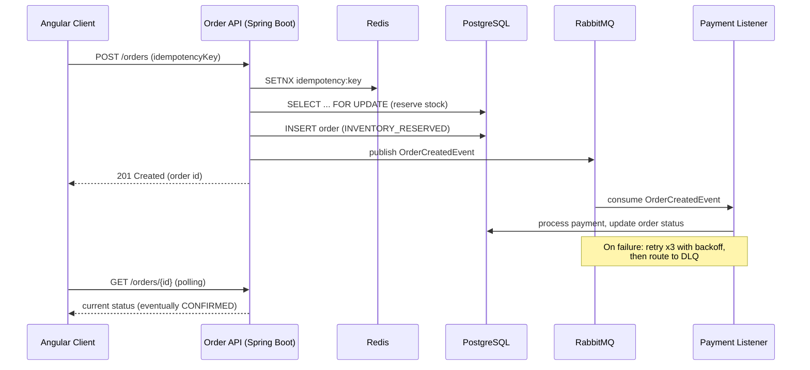

# Order Processing System

A distributed order processing pipeline demonstrating production-grade
backend engineering: idempotent APIs, asynchronous messaging with
retry/dead-letter handling, cache-vs-correctness separation, pessimistic
locking under concurrency, and full integration test coverage against real
infrastructure via Testcontainers.

**Stack:** Java 21 / Spring Boot 4 (Spring Framework 7, Jakarta EE 11) ·
Angular 22 · PostgreSQL 16 · Redis 7 · RabbitMQ 3 · Docker Compose ·
GitHub Actions

## Why this project exists

Most portfolio CRUD apps stop at "it works on my machine." This one is
built to survive the questions a senior engineering interview actually
asks: *What happens if this request is retried? What happens under
concurrent writes? What happens if the payment provider is down? How do
you know your caching doesn't cause bugs?* Each of those questions has a
concrete, working answer in this codebase — see `docs/adr/` for the
reasoning behind each one.

## Architecture



**Key design decisions** (full reasoning in `docs/adr/`):
- **RabbitMQ over Kafka** — this is a task queue, not an event log; DLQ semantics come free (ADR-0002)
- **Two-layer idempotency** — Redis for speed, DB unique constraint for correctness (ADR-0003)
- **Cache reads, never cache the reservation decision** — pessimistic DB lock guards actual stock (ADR-0004)

## Project structure

```
order-processing-system/
├── backend/                  # Spring Boot API
│   ├── src/main/java/...     # domain, service, controller, messaging, config
│   ├── src/main/resources/db/migration/  # Flyway schema
│   └── src/test/java/...     # unit tests + Testcontainers integration tests
├── frontend/                 # Angular 18 standalone-components app
│   └── src/app/
│       ├── core/             # models, services, HTTP interceptor
│       └── features/         # order placement, order status, product list
├── docs/adr/                 # Architecture Decision Records
├── .github/workflows/        # CI pipelines
├── docker-compose.yml
└── CHANGELOG.md
```

## Version requirements

Spring Boot 4 and Angular 22 both bumped their platform floors — make sure
your local tooling matches before running this outside Docker:

| Tool | Required version | Why |
|---|---|---|
| Java | 17+ (21 LTS used here) | Spring Boot 4 baseline (Jakarta EE 11 / Servlet 6.1) |
| Node.js | 22.12+ | Angular 22 baseline |
| Maven | 3.9+ | Spring Boot 4 parent POM |

If you're running the backend/frontend directly from IntelliJ/VS Code
rather than Docker, confirm `java -version` and `node -v` meet these
floors first — this is the single most common local setup failure after
a major-version upgrade like this one.

## Running locally

### Option A — everything in Docker (fastest way to see it working)
```bash
docker-compose up --build
```
- Frontend: http://localhost:4200
- Backend API: http://localhost:8080/api/v1
- Swagger UI: http://localhost:8080/swagger-ui.html
- RabbitMQ management UI: http://localhost:15672 (guest/guest)
- Actuator health: http://localhost:8080/actuator/health

### Option B — backend/frontend running locally in IntelliJ / VS Code (for active development)

1. **Start infrastructure only:**
   ```bash
   docker-compose up postgres redis rabbitmq
   ```

2. **Backend (IntelliJ):**
   - Open `backend/` as a Maven project in IntelliJ.
   - Run `OrderProcessingApplication.main()` directly, or `mvn spring-boot:run`.
   - Flyway migrations run automatically on startup.

3. **Frontend (VS Code):**
   ```bash
   cd frontend
   npm install
   npm start
   ```
   Serves on http://localhost:4200 and proxies API calls to `localhost:8080`.

## Running tests

```bash
# Backend: unit tests + Testcontainers integration tests (requires Docker running)
cd backend && mvn verify

# Frontend: unit tests (headless Chrome)
cd frontend && npm test
```

## What to point to in an interview

| Ask about... | Look at... |
|---|---|
| Handling duplicate requests | `IdempotencyService`, `OrderService.placeOrder`, ADR-0003 |
| Preventing overselling under concurrency | `ProductRepository.findByIdForUpdate` (pessimistic lock), ADR-0004 |
| Async processing / resilience | `OrderEventListener` (retry + backoff), `RabbitConfig` (DLQ) |
| Testing strategy | `OrderServiceTest` (unit, mocked), `OrderControllerIntegrationTest` (Testcontainers, real Postgres+RabbitMQ) |
| Why this broker / this cache design | `docs/adr/0002`, `docs/adr/0004` |
| CI/CD discipline | `.github/workflows/backend-ci.yml`, `.github/workflows/frontend-ci.yml` |

## License
MIT
